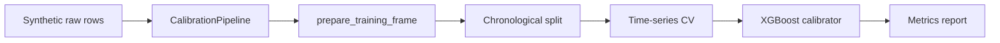

# Weather Forecast Calibration

This is a sanitized portfolio version of a weather forecast calibration project.
It demonstrates the data engineering and data science workflow without exposing
private data sources, production feature definitions, station-specific settings,
market logic, model artifacts, or trading strategy details.

## Goal

The goal of this project is to calibrate a baseline daily maximum temperature
forecast. The baseline forecast represents an National Blend Model (NBM) forecast of the day's
maximum temperature, and the machine learning model is trained to predict the
error made by that baseline forecast:

```text
forecast_error = observed_max_temperature - baseline_forecast_max_temperature
corrected_forecast = baseline_forecast_max_temperature + predicted_error
```

The public version uses synthetic data and anonymous features to demonstrate the
pipeline, validation strategy, and model evaluation workflow without revealing
any private feature engineering or production logic.

## What This Shows

- Synthetic data generation for reproducible demos and tests
- A small ETL-style pipeline with extract and transform stages
- Anonymous model features named `x_00`, `x_01`, etc.
- Forecast-error target construction
- Chronological train/test splitting
- Time-series cross-validation
- XGBoost calibration against an uncalibrated forecast baseline
- Unit tests for data generation, transformation, and modeling

## What Is Intentionally Excluded

- Real feature names or feature engineering formulas
- Real station lists, schedules, or collection commands
- Real forecast/observation files
- Market parsing, signal generation, sizing, order placement, or API clients
- Trained model artifacts and residual distributions
- Any private edge or production configuration

## Architecture



## Quick Start

Install the project in editable mode:

```bash
python -m pip install -e ".[dev]"
```

Generate synthetic data:

```bash
python -m weather_calibration make-data --output data/synthetic_weather.csv --days 900 --seed 42
```

Train and evaluate the calibrator:

```bash
python -m weather_calibration train --input data/synthetic_weather.csv --report reports/model_metrics.json
```

Run tests:

```bash
pytest
```
